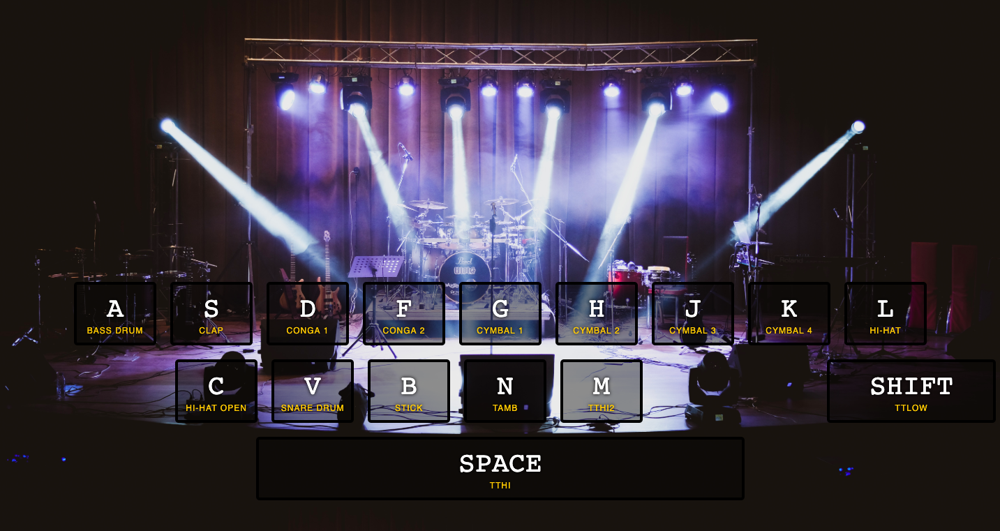

What I've learned
-
- <strong>data-* : </strong> This attribute allows us to store extra information on HTML elements without other things such as non-standart attributes or extra properties. We can use it with any name what we want such as data-name, data-key, data-columns.

- <strong>kbd :</strong> The HTML ``<kbd>`` tag defines keyboard input. It is a phrase tag.

- <strong>keydown : </strong> It's an event which is fired when a key is pressed. Unlike the keypress event, the keydown event is fired for all keys, regardless of whether they produce a character value and it repeats while the user keeps the key depressed.

- <strong>classList : </strong> The classList property is read-only, however, you can modify it by using the add() and remove() methods. It has six methods : <em>add, remove, toggle, item, contains, replace</em>. For example :
we used <em>clasList</em> property to add and remove the animation in <em>".playing"</em> class by using ``key.classList.add("playing")`` and  ``     e.target.classList.remove("playing")``

- <strong>transitionend : </strong> It's a types of TransitionEvent and transitionend event is fired when a CSS transition has completed. There are 4 types of TransitionEvent on <a href="https://developer.mozilla.org/en-US/docs/Web/API/TransitionEvent#Types_of_TransitionEvent"> MDN.</a>
To decide what to do after animation, we needed to use this event in our <em>"keys.forEach"</em> loop.

Actually at every stage I stoped the video and searched some keyword or usage. I benefit from this project so much.