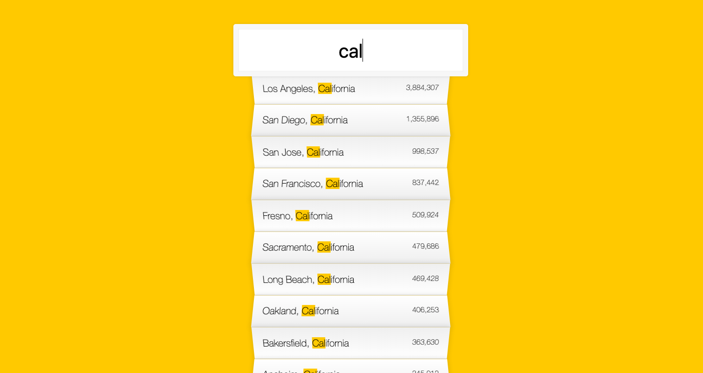

What I've learned
-

First of all, I have to say that I had difficulty in doing this challenge. There were lots of things I didn't know. For now, I saw some methods, and the usage of them. But I can't say that I learned them properly. I think I'll do another side project related to this. 

-<strong>Fetch API : </strong> This is a method in the Window Object. The fetch() method takes one mandatory argument, the path to the resource you want to fetch.  It returns a Promise that resolves to the Response to that request, whether it is successful or not. I've watched <a href="https://www.youtube.com/watch?v=Oive66jrwBs&list=LLSY-i-eyhAsXkJID8G4NqKQ&index=2&t=477s">this video</a> by <a href="https://www.youtube.com/channel/UC29ju8bIPH5as8OGnQzwJyA">Traversy Media</a> to understand clearly fetch(). And I've found <a href="https://gist.github.com/justsml/529d0b1ddc5249095ff4b890aad5e801"> this gist</a>.

-<strong>new RegExp() :</strong> Actually I know RegExp a bit. But I think I should commit something to memory. I've watched some videos at <a href="https://www.youtube.com/playlist?list=PLRqwX-V7Uu6YEypLuls7iidwHMdCM6o2w">this list</a> by <a href="https://www.youtube.com/channel/UCvjgXvBlbQiydffZU7m1_aw"> The Coding Train</a> and I've glanced at <a href="https://developer.mozilla.org/tr/docs/Web/JavaScript/Reference/Global_Objects/RegExp">MDN</a> again. I have to admit that I'm not good at RegExp still :) 

