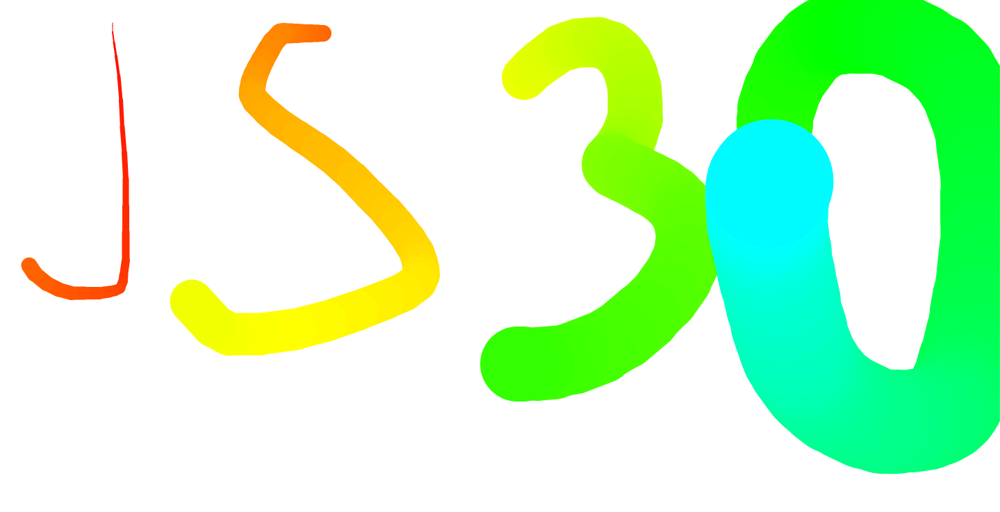

What I've learned
-


I'm not sure how right it is to say "I learned" :)
Now, I'm familiar to Canvas and its line styles, paths and so on. 

<strong>- getContext(contextType) : </strong> The getContext() method returns an object that provides methods and properties for drawing on the canvas. As a contextType, we can use "2d" to draw text, lines, boxes, circles -and more- on the canvas. For more <a href="https://developer.mozilla.org/en-US/docs/Web/API/HTMLCanvasElement/getContext#Parameters">parameters</a>.

<strong>- strokeStyle: </strong> It specifies color, gradient or pattern used for strokes.

`context.strokeStyle=color|gradient|pattern;`

We used `ctx.strokeStyle = hsl(${hue}, 100%, 50%)` for the color of strokes. And since "hue" is our other variable, we were able to control the color change in strokes.

<strong>- beginPath() : </strong> This method starts a new path by empyting the list of subs-paths. When we want to create a new path, we call this method.

```
const canvas = document.getElementById('canvas');
const ctx = canvas.getContext('2d');

// First path
ctx.beginPath();
ctx.strokeStyle = 'blue';
ctx.moveTo(20, 20);
ctx.lineTo(200, 20);
ctx.stroke();

// Second path
ctx.beginPath();
ctx.strokeStyle = 'green';
ctx.moveTo(20, 20);
ctx.lineTo(120, 120);
ctx.stroke();
```

<strong>- moveTo(): </strong> This method begins a new sub-path at the point specified by the given (x, y) coordinates. 

 ` Syntax --> ctx.moveTo(x, y);`
The x-axis (horizontal) coordinate of the point and the y-axis (vertical) coordinate of the point. 
For playing moveTo() for <a href="https://www.w3schools.com/tags/playcanvas.asp?filename=playcanvas_movetoy">y-axis</a> or <a href="https://www.w3schools.com/tags/playcanvas.asp?filename=playcanvas_movetox"> x-axis</a>.

```Tip--> Use the stroke() method to actually draw the path on the canvas.```

<strong>- lineTo(): </strong> This method adds a new point and creates a line TO that point FROM the last specified point in the canvas. This method does not draw the line. For drawing a line, use stroke() method like `moveTo()` method.

`Syntax --> context.lineTo(x,y);` 

Parameter x, create a line on the x-coordinate and y, create a line on the y-coordinate. For playing <a href= "https://www.w3schools.com/tags/tryit.asp?filename=tryhtml5_canvas_lineto2">lineTo()</a>.


<strong>- stroke() : </strong> The stroke() method actually draws the path you have defined with all those moveTo() and lineTo() methods. The default color is black.
We must use strokeStyle() to draw with another color/gradient. 


