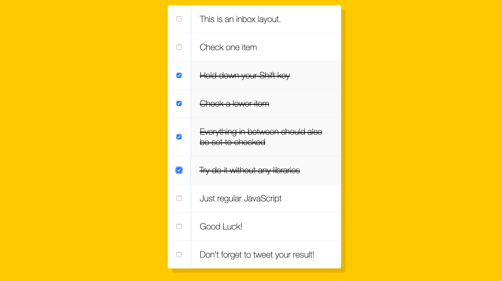

What I've learned
-

-<strong>KeyboardEvent shiftKey : </strong> This property is a read-only property and used to return a Boolean value which indicates the SHIFT key is pressed or not. If SHIFT key is pressed shiftKey property returns true, otherwise returns false. 

We need to check for shift because only if shift is pressed do we want to do a group check of checkboxes. When we pressed the SHIFT key we can use to indicate the "lastCheck".

``` 
function handleCheck(e) {

  //check if shift key was pressed 
  // and that the checkbox is checked
  if (e.shiftKey && this.checked) {
    //logic goes here
  }

  // the logic comes before updating last check as we don't want to 
  //   overwrite the variable before using it
  lastChecked = this
}
```

