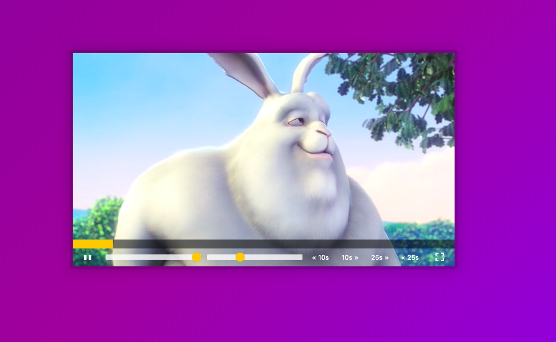
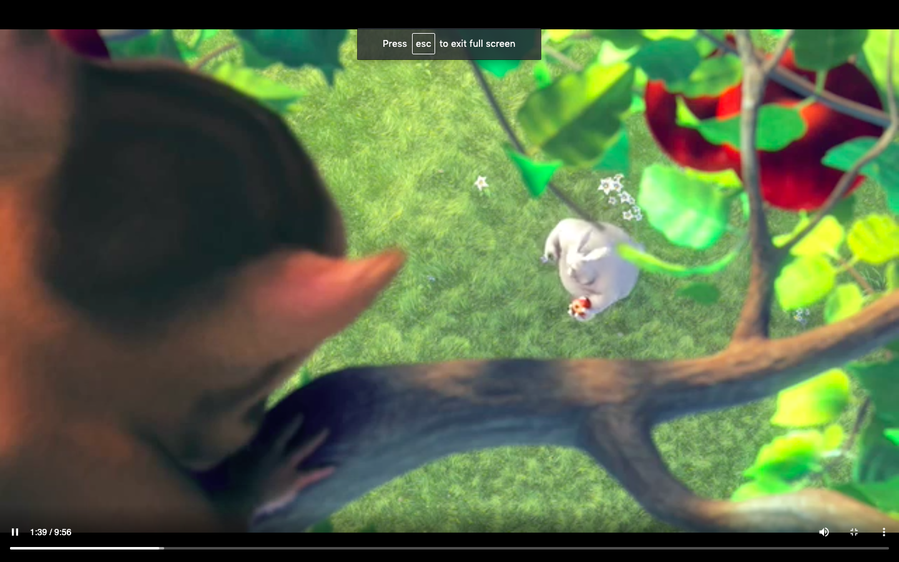

What I've learned
-

- Day by day I started to love the challenges more. Every challenge teaches me something I don't know but I wonder. And while following Wes Bos I learn code culture such as the approaching of the problem solving, writing code, how important is function naming and so on. 

- I've learned at this challenge some video's properties, methods or events such as play, pause, timeupdate, currentTime and so on. I tried to read some artciles or watch some tutorials related to this. <a href="https://developer.mozilla.org/en-US/docs/Web/API/HTMLMediaElement">MDN</a> and <a href="https://www.html5rocks.com/en/tutorials/video/basics/#toc-javascript">html5rocks</a> gave me a perspective to understand on how to work with videos. I think, one day If I come across a problem about videos, I will know where I need to look at. 
