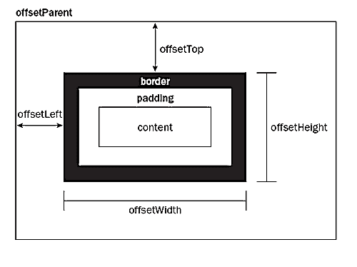

-What I've learned
-

<strong>- scrollY : </strong> 
The scrollY read-only property returns the pixels the current document has been scrolled from the top of the window, vertically.

syntax:

`var y = window.scrollY`

<strong>- offsetTop : </strong> The offsetTop property returns the top position (in pixels) relative to the top of the offsetParent element.

<strong>- debounce function</strong> I did a little search on the internet about the debounce function. There are generally built-in function in some library such as lodash, underscorejs. They are used not only in scroll events but also in other events such as key events. This is a perfect <a href="https://css-tricks.com/debouncing-throttling-explained-examples/"> article</a> about it.
